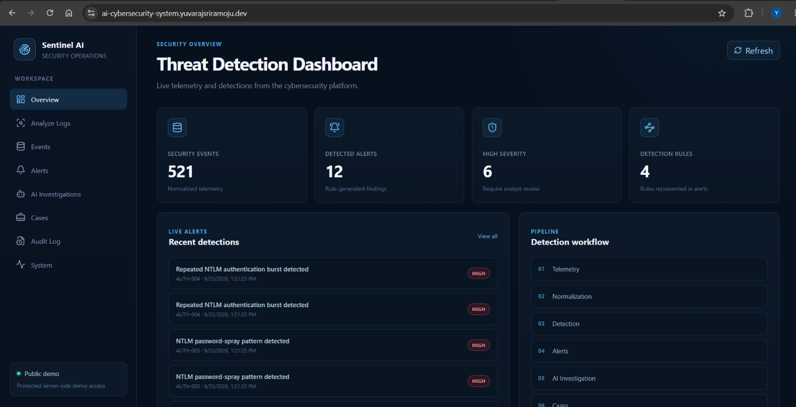
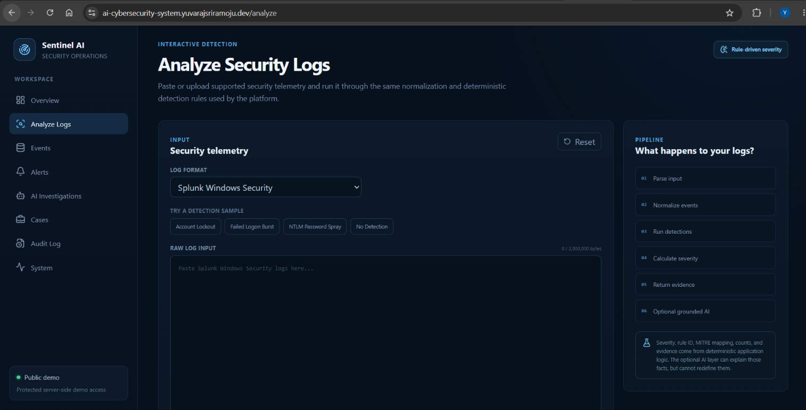
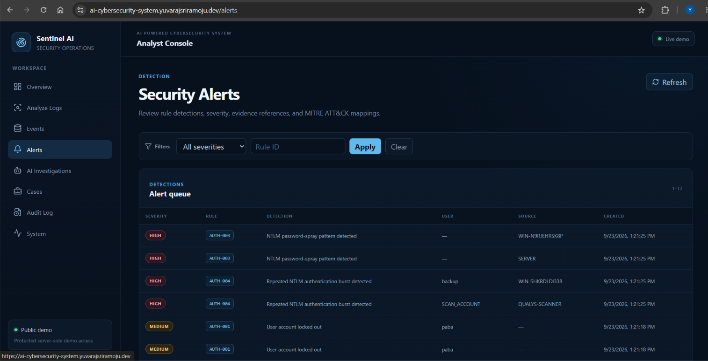
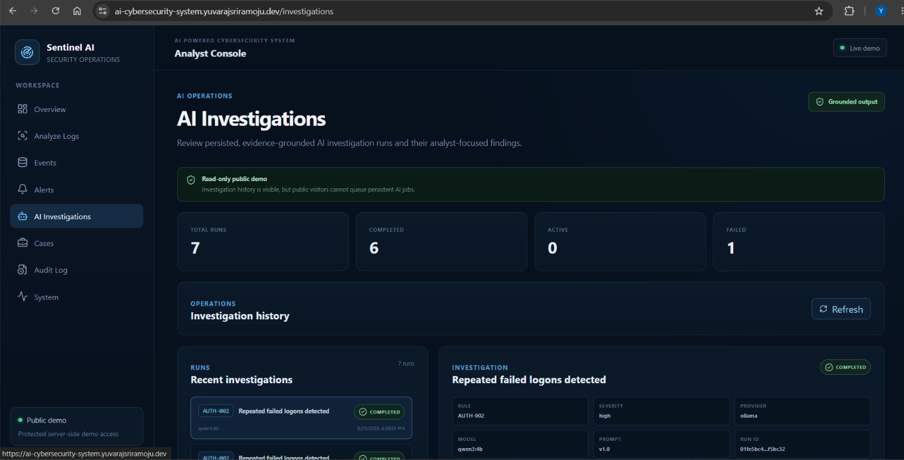
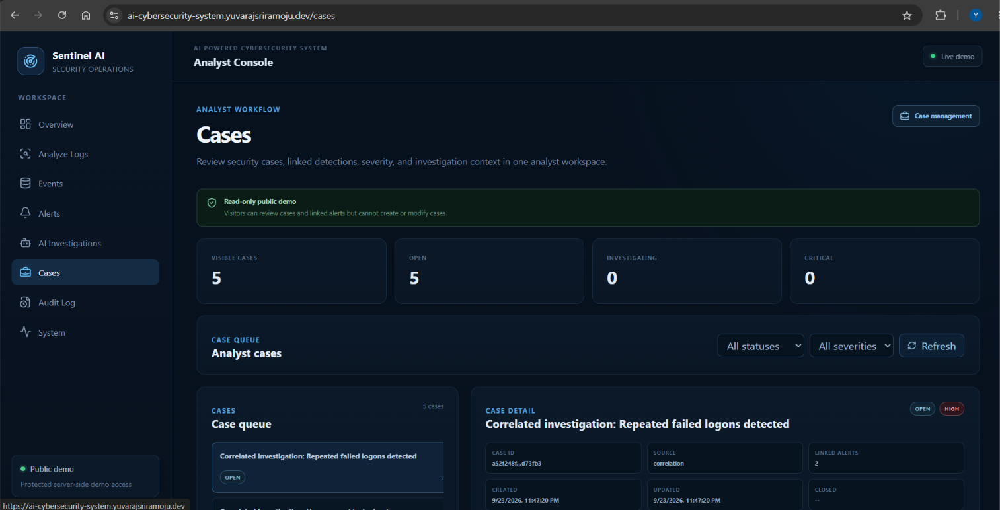
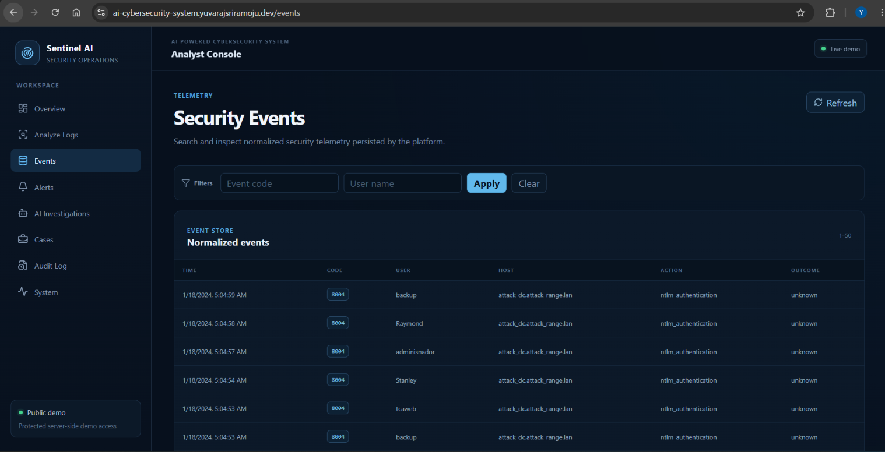
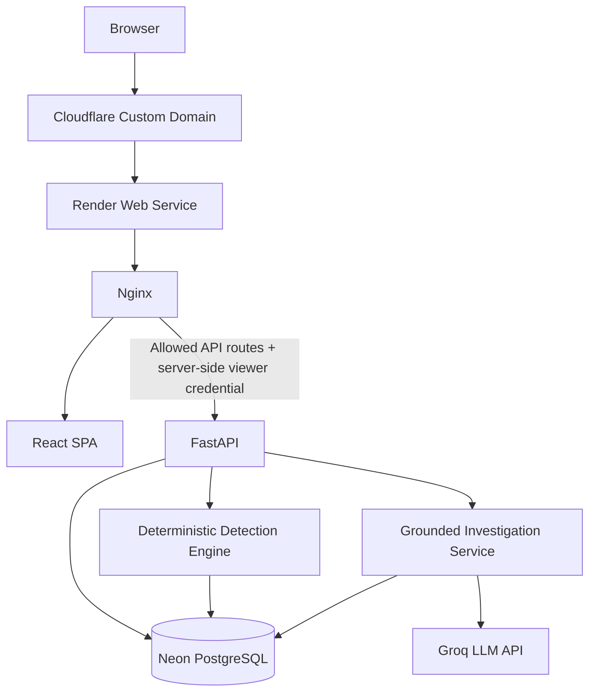
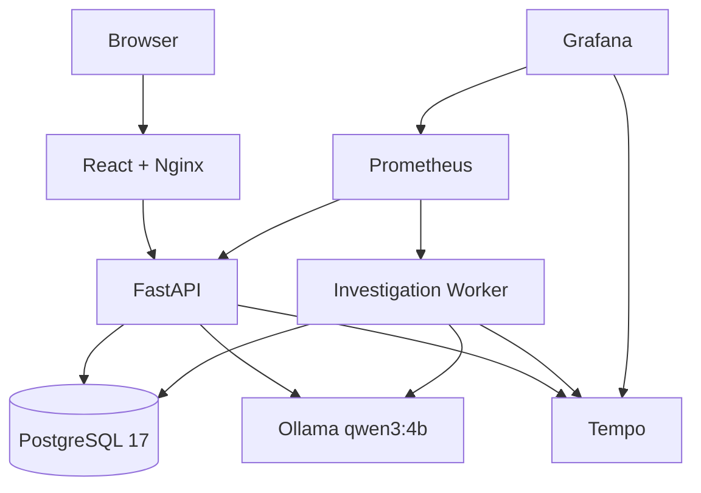

# AI-Powered Cybersecurity System

[](https://ai-cybersecurity-system.yuvarajsriramoju.dev)
[](https://www.python.org/)
[](https://fastapi.tiangolo.com/)
[](https://react.dev/)
[](https://www.postgresql.org/)
[](https://www.docker.com/)

A production-style cybersecurity analytics platform that ingests Windows security telemetry, normalizes events, detects authentication attacks, correlates alerts, supports SOC investigations and cases, and produces grounded LLM explanations without allowing the model to make security severity decisions.

## Live Demo

**https://ai-cybersecurity-system.yuvarajsriramoju.dev**

The public demo opens directly without a login or browser-visible API key. A restricted viewer credential is injected server-side by Nginx.

> The free hosting tier may require a short cold start after a period of inactivity.

---

## Screenshots

### Security Overview



The dashboard summarizes normalized telemetry, detected alerts, high-severity findings, detection-rule coverage, and recent security activity.

### Interactive Log Analysis



Security telemetry can be analyzed through the same normalization and deterministic detection pipeline used by the backend. The optional AI layer explains detected findings without controlling rule ID, severity, MITRE mapping, or evidence selection.

### Security Alerts



The alert workspace exposes deterministic detections, severity, rule identifiers, affected identities, sources, timestamps, and MITRE ATT&CK mappings.

### AI Investigations



Persisted investigation runs demonstrate evidence-grounded analyst assistance and investigation history. Some demo records were generated locally with Ollama before the dataset was migrated to the hosted environment; live interactive AI analysis uses Groq.

### SOC Cases



Cases correlate related detections into an analyst workflow while the public portfolio environment remains read-only for mutation operations.

### Normalized Security Events



The event workspace exposes normalized Windows security telemetry and the canonical evidence that feeds deterministic detections.

---

## Why This Project

Many cybersecurity portfolio projects stop at a notebook, a single detection script, or a chatbot layered over logs.

This project was built to answer the harder systems-engineering questions behind an end-to-end security product:

- How do raw security logs become a stable canonical event schema?
- How should deterministic detections and AI explanations be separated?
- How can alert evidence remain traceable back to the original events?
- How should an AI response be validated before an analyst sees it?
- How do authentication, RBAC, audit logging, observability, migrations, CI, frontend delivery, and deployment fit together?
- How can a public portfolio demo remain useful without exposing privileged API operations or credentials?

A core design principle is:

> **Use deterministic systems for security decisions and AI to help analysts understand the evidence.**

The LLM does not create alerts and does not assign severity.

---

## Key Capabilities

### Security telemetry ingestion

Supported input formats include:

- Splunk-style Windows Security key/value logs
- Windows NTLM XML events
- multi-record streaming parsing
- canonical event normalization
- stable event fingerprinting
- persistence deduplication

### Deterministic threat detection

| Rule | Detection | Severity | MITRE ATT&CK |
|---|---|---:|---|
| `AUTH-001` | Account lockout | Medium | Authentication activity |
| `AUTH-002` | Failed logon burst: 5 attempts within 5 minutes | High | `T1110.001` Password Guessing |
| `AUTH-003` | NTLM password spray across 20 distinct users within 5 minutes | High | `T1110.003` Password Spraying |
| `AUTH-004` | High-volume NTLM attempts against one user within 5 minutes | High | `T1110.001` Password Guessing |

Representative Windows telemetry includes:

- Event ID `4625`
- Event ID `4740`
- NTLM operational Event ID `8004`

### AI-assisted investigation

The investigation pipeline:

1. Loads an existing deterministic alert.
2. Resolves the exact evidence events.
3. Builds a bounded investigation context.
4. Requests structured output from the configured LLM.
5. Validates the response schema.
6. Performs grounding validation.
7. Rejects invalid or unsupported claims.

Investigation output includes:

- authentication outcome
- evidence summary
- observed behavior
- uncertainty
- recommended next steps

If the telemetry does not establish authentication success or failure, the system preserves the outcome as unknown.

### SOC workflow

The React frontend provides:

- Overview
- Analyze Logs
- Events
- Alerts
- AI Investigations
- Cases
- Audit Log
- System

### Experimental ML baseline

The repository also contains an anomaly-detection experimentation path using engineered authentication features, Isolation Forest, scikit-learn, MLflow experiment tracking, and persisted experiment artifacts.

This ML path is intentionally separate from the deterministic production detection path.

---

## Hosted Architecture



Hosted request path:

```text
Browser
   |
   v
Cloudflare custom domain
   |
   v
Render
   |
   v
Nginx
   |---- React static frontend
   |
   +---- FastAPI on localhost:8000
              |
              +---- Neon PostgreSQL
              |
              +---- Groq LLM API
```

The hosted portfolio environment uses a single Render container to reduce infrastructure overhead and cold-start duplication while preserving a more complete distributed architecture locally.

---

## Local Architecture



Local development keeps the API, worker, database, frontend, metrics, tracing, and dashboard components separate.

---

## Detection and Investigation Flow

```mermaid
flowchart LR
    RAW[Raw Logs]
    PARSE[Parsing]
    NORM[Normalization]
    FP[Event Fingerprint]
    RULES[Deterministic Rules]
    ALERT[Alert]
    EVIDENCE[Evidence Resolution]
    LLM[LLM Explanation]
    VALIDATE[Schema + Grounding Validation]
    RESULT[Investigation Result]

    RAW --> PARSE
    PARSE --> NORM
    NORM --> FP
    FP --> RULES
    RULES --> ALERT
    ALERT --> EVIDENCE
    EVIDENCE --> LLM
    LLM --> VALIDATE
    VALIDATE --> RESULT
```



The LLM runs only after deterministic detection.

---

## AI Provider Architecture

The investigation service uses an internal provider abstraction so domain logic is not tied to a single LLM vendor.

### Local

```text
CYBERSEC_LLM_PROVIDER=ollama
CYBERSEC_LLM_MODEL=qwen3:4b
```

### Hosted

```text
CYBERSEC_LLM_PROVIDER=groq
CYBERSEC_LLM_MODEL=openai/gpt-oss-20b
```

The Groq provider includes structured JSON-schema responses, bounded retries, request timeouts, response-size limits, retryable HTTP handling, safe provider errors, and OpenTelemetry span integration.

---

## Security Design

### Authentication and RBAC

Supported API roles:

```text
viewer
analyst
admin
```

API credentials are represented internally using SHA-256 digests.

### Public demo credential isolation

The hosted demo uses a server-side `DEMO_API_KEY`.

```text
Render secret
    |
    v
startup script
    |
    +---- SHA-256 digest -> FastAPI credential configuration
    |
    +---- raw key -> Nginx request injection
```

The React bundle never receives the raw credential.

### Public edge allowlist

Examples of portfolio-safe routes:

```text
GET  /api/v1/events
GET  /api/v1/events/{id}
GET  /api/v1/alerts
GET  /api/v1/alerts/{id}
GET  /api/v1/alerts/{id}/evidence
POST /api/v1/analyze
POST /api/v1/analyze/explain
GET  /api/v1/alerts/{id}/investigations
GET  /api/v1/alerts/{id}/investigations/{run}
GET  /api/v1/cases
GET  /api/v1/cases/{id}
GET  /api/v1/audit/public
GET  /health/live
GET  /health/ready
```

The public edge blocks telemetry ingestion, case mutations, investigation mutations, full audit access, correlation operations, Prometheus metrics, OpenAPI, Swagger, and ReDoc.

AI-backed analysis is rate-limited more aggressively than deterministic analysis.

Additional controls include trusted-host handling, security response headers, request body limits, sanitized public audit output, bounded LLM responses, fail-closed grounding validation, and database-backed readiness checks.

---

## Persistence

Core PostgreSQL entities include:

```text
security_events
alerts
investigation_runs
cases
case_alerts
audit_events
```

Schema evolution is managed with Alembic.

The deployed demo database contains:

```text
521 security events
12 alerts
7 investigation runs
5 cases
12 case-alert relationships
6 audit events
```

The hosted deployment uses Neon PostgreSQL.

---

## Observability

Local development includes:

- Prometheus metrics
- Grafana dashboards
- Tempo traces
- OpenTelemetry instrumentation

Hosted tracing is intentionally disabled because the public free-tier deployment does not run a hosted Tempo collector.

The `/metrics` endpoint is also blocked at the public edge.

---

## Technology Stack

| Layer | Technology |
|---|---|
| Frontend | React, TypeScript, Vite |
| Reverse Proxy | Nginx |
| API | FastAPI |
| Runtime | Python 3.13 |
| ORM | SQLAlchemy |
| Database | PostgreSQL 17 |
| Migrations | Alembic |
| Hosted Database | Neon |
| Local LLM | Ollama / `qwen3:4b` |
| Hosted LLM | Groq / `openai/gpt-oss-20b` |
| ML | scikit-learn Isolation Forest |
| Experiment Tracking | MLflow |
| Metrics | Prometheus |
| Tracing | OpenTelemetry + Tempo |
| Dashboards | Grafana |
| Containers | Docker / Docker Compose |
| CI | GitHub Actions |
| Hosting | Render |
| DNS / Domain | Cloudflare |

---

## Repository Structure

```text
.
├── .github/
│   └── workflows/
├── data/
│   └── raw/
├── deploy/
│   └── render/
├── frontend/
│   ├── nginx/
│   ├── public/
│   └── src/
├── migrations/
│   └── versions/
├── observability/
│   ├── grafana/
│   ├── prometheus/
│   └── tempo/
├── scripts/
├── src/
│   └── cybersec/
│       ├── ai/
│       ├── api/
│       ├── core/
│       ├── db/
│       ├── detection/
│       ├── domain/
│       ├── ingestion/
│       ├── ml/
│       ├── normalization/
│       ├── observability/
│       ├── services/
│       └── workers/
├── tests/
│   ├── integration/
│   └── unit/
├── alembic.ini
├── docker-compose.yml
├── Dockerfile
├── Dockerfile.render
├── pyproject.toml
└── README.md
```

---

## Local Development

### Prerequisites

- Python 3.13
- Docker Desktop
- Node.js
- Ollama
- Git

Pull the local model:

```powershell
ollama pull qwen3:4b
```

Clone the repository:

```powershell
git clone https://github.com/yuvsriram/ai-cybersecurity-system.git
cd ai-cybersecurity-system
```

Create local configuration:

```powershell
Copy-Item .env.example .env
```

Create the Python environment:

```powershell
py -3.13 -m venv .venv
.\.venv\Scripts\Activate.ps1

python -m pip install --upgrade pip
python -m pip install -e ".[dev]"
```

Validate Docker Compose without printing secrets:

```powershell
docker compose config --quiet
docker compose config --services
```

Apply migrations:

```powershell
python -m alembic upgrade head
```

Frontend validation:

```powershell
npm --prefix frontend ci
npm --prefix frontend run lint
npm --prefix frontend run build
```

---

## Testing

Run the complete backend test suite:

```powershell
python -m pytest
```

The project contains unit and integration coverage for parsers, normalization, event identity, authentication and NTLM detections, AI grounding, LLM providers, authentication/RBAC, API routes, ingestion, auditing, security headers, metrics protection, persistence, correlation, workers, ML logic, and observability helpers.

---

## Container Builds

Backend:

```powershell
docker build -t cybersec-app:local .
```

Frontend:

```powershell
docker build -t cybersec-frontend:local frontend
```

Render single-container image:

```powershell
docker build -f Dockerfile.render -t cybersec-render:local .
```

---

## Deployment

Deployment-specific files:

```text
Dockerfile.render
Dockerfile.render.dockerignore
deploy/render/nginx.conf
deploy/render/start.sh
```

Hosted architecture:

```text
Cloudflare
    ↓
Render
    ↓
Nginx
    ├── React
    └── FastAPI
           ├── Neon PostgreSQL
           └── Groq
```

The Render startup process validates required secrets, normalizes the PostgreSQL URL, derives the viewer API-key digest, renders and validates Nginx, applies Alembic migrations, starts FastAPI on loopback port `8000`, and starts Nginx on Render's public port.

Hosted secrets include:

```text
DATABASE_URL
DEMO_API_KEY
GROQ_API_KEY
```

They are stored in Render and are not committed to Git.

---

## CI

GitHub Actions validates:

- Python 3.13
- PostgreSQL 17
- dependency consistency
- package imports
- Alembic migrations
- backend test suite
- frontend linting
- frontend production build
- production container builds

---

## Example Detection

Five failed Windows logons for the same account and source within five minutes can produce:

```text
Rule:       AUTH-002
Severity:   high
Evidence:   5
MITRE:      T1110.001
```

The AI layer then explains those exact evidence events while preserving the deterministic severity.

---

## Project Status

Implemented:

- Windows security log ingestion
- NTLM XML ingestion
- canonical normalization
- stable event identity
- persistence deduplication
- deterministic authentication detections
- MITRE mappings
- evidence integrity
- REST APIs
- API-key authentication
- role-based authorization
- audit logging
- grounded AI investigations
- investigation persistence
- investigation worker
- case management
- correlation
- ML anomaly baseline
- Prometheus
- Grafana
- Tempo
- OpenTelemetry
- React SOC frontend
- hardened public-demo Nginx policy
- GitHub Actions CI
- Neon PostgreSQL deployment
- Groq integration
- Render deployment
- Cloudflare custom domain

---

## Author

**Yuvaraj Sriramoju**

Live demo:

https://ai-cybersecurity-system.yuvarajsriramoju.dev

GitHub:

https://github.com/yuvsriram/ai-cybersecurity-system
